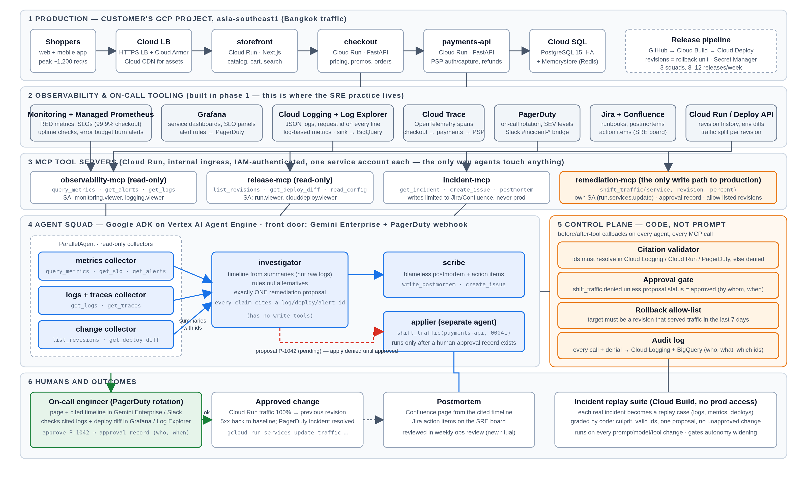

# agentic-sre

A Thai e-commerce retailer (anonymised) with small dev teams and no ops function kept shipping
changes that broke production. This repo is the reference implementation of what we built with them:

1. **`system/`** - the real stack: storefront + checkout (FastAPI, promo-config incident where health is
   green but checkouts fail), `payments_api` (Cloud Run + Cloud SQL, pool-size regression), load generator,
   and `scripts/` to provision / deploy / break / roll back on GCP (`PROJECT=<id>` - nothing runs until you do).
2. **`evidence/`** - frozen, SHA-256-sealed incident bundles. `make_bundle.py` builds the synthetic one;
   `gcp_snapshot.py` freezes the last 45 min of Monitoring / Logging / revisions from a real project.
3. **`agents/v1`** - the single ADK agent we started with. No gates. Kept to show why.
4. **`agents/v2`** - ADK multi-agent (parallel collectors -> investigator -> scribe) with the control plane
   in code: audit log, citation validator, approval-gated apply.
5. **`mcp_servers/`** - the four MCP tool servers the agents reach everything through (observability /
   release / incident read; `remediation-mcp` = the one production write, gated on an approval record).
   `SRE_SOURCE=bundle` serves the frozen bundle offline; `SRE_SOURCE=gcp` serves the live project. Each is
   its own Cloud Run service with its own least-privilege service account (`system/scripts/70_mcp_servers.sh`).
6. **`system/grafana/`, `34_pagerduty.sh`, `agents/trigger/`** - Grafana on Cloud Run over Cloud Monitoring,
   PagerDuty as the paging channel, PagerDuty webhook -> Agent Engine trigger.
7. **`evals/`** - graded replays over the frozen bundle.



Read `docs/ARCHITECTURE.md` for the decisions and tradeoffs, `DEMO.md` for the walk-through.

```zsh
make setup && make test          # offline: no API key, no GCP
export GOOGLE_API_KEY=...        # or GOOGLE_GENAI_USE_VERTEXAI=1 GOOGLE_CLOUD_PROJECT=... GOOGLE_CLOUD_LOCATION=asia-southeast1
make v1                          # watch it fixate / dump logs / try to apply
make v2                          # collectors -> investigator proposes P-xxxx -> scribe
make apply P=P-xxxx              # PolicyDeny (not approved)
make approve P=P-xxxx && make apply P=P-xxxx
make audit
```

## Deploy order (GCP, `PROJECT=<id>`)

```zsh
make deploy-system PROJECT=...   # APIs, Cloud SQL, payments-api, checkout, alerts, dashboard, Grafana, PagerDuty channel (PAGERDUTY_KEY)
make deploy-mcp    PROJECT=...   # observability/release/incident/remediation MCP servers, internal ingress, IAM
make deploy-agent  PROJECT=...   # v2 squad on Agent Engine + PagerDuty webhook trigger (AGENT_ENGINE_ID, PAGERDUTY_WEBHOOK_SECRET)
SRE_TOOLS=mcp OBS_MCP_URL=... RELEASE_MCP_URL=... INCIDENT_MCP_URL=... REMEDIATION_MCP_URL=... make v2
system/scripts/40_break.sh && system/scripts/50_loadgen.sh   # the incident, for real
```
